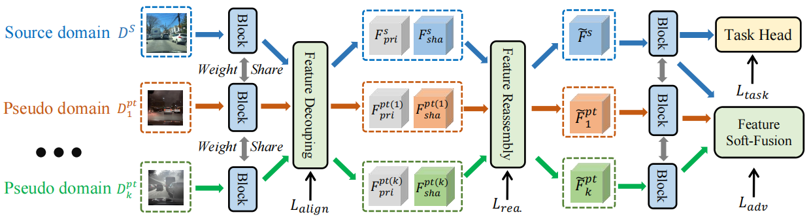

## Let Synthetic Data Shine: Domain Reassembly and Soft-Fusion for Single Domain Generalization
<!---
  	
  
--->

## abstract
Single Domain Generalization (SDG) aims to train models with consistent performance across diverse scenarios using data from a single source.  While using latent diffusion models (LDMs) show promise in augmenting limited source data, we demonstrate that directly using synthetic data can be detrimental due to significant feature distribution discrepancies between synthetic and real target domains, leading to performance degradation. To address this issue, we propose Discriminative Domain Reassembly and Soft-Fusion (DRSF), a training framework leveraging synthetic data to improve model generalization. We employ LDMs to produce diverse pseudo-target domain samples and introduce two key modules to handle distribution bias. First, Discriminative Feature Decoupling and Reassembly (DFDR) module uses entropy-guided attention to recalibrate channel-level features, suppressing synthetic noise while preserving semantic consistency. Second, Multi-pseudo-domain Soft Fusion (MDSF) module uses adversarial training with latent-space feature interpolation, creating continuous feature transitions between domains. Extensive SDG experiments on object detection and semantic segmentation tasks demonstrate that DRSF achieves substantial performance gains with only marginal computational overhead. Notably, DRSF's plug-and-play architecture enables seamless integration with unsupervised domain adaptation paradigms, underscoring its broad applicability in addressing diverse and real-world domain challenges.

<section class="section" id="BibTeX">
  

    <h2 class="title">BibTeX</h2>
    <pre><code>@Article{xx,
      title        = {xxx},
      author       = {xx},
      journal      = {xx},
      year         = {xx}
}</code></pre>
  

</section>
